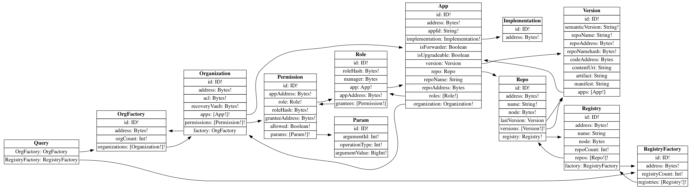

# Organizations

This is the main connector of the Aragon Connect library. It is responsible of parsing the organization’s data.

Currently a single flavor of this connector is available, built-in the core library using The Graph. We have plans to keep including other flavors, like an Ethereum connector that reduces the state from blockchain events, or a SQL connector that fetches data from a database, etc.

## Connector Interface

The connector to be compatible with Aragon Connect library should implement the following interface:

```javascript
chainId?: number
permissionsForOrg(orgAddress: string): Promise<Permission[]>
onPermissionsForOrg(orgAddress: string, callback: Function): { unsubscribe: Function }
appsForOrg(orgAddress: string): Promise<App[]>
onAppsForOrg(orgAddress: string, callback: Function): { unsubscribe: Function }
repoForApp(appAddress: string): Promise<Repo>
appByAddress(appAddress: string): Promise<App>
rolesForAddress(appAddress: string): Promise<Role[]>
```

## The Graph Connector

This connector was built using The Graph and uses GraphQL as a query language for fetching data.

### GraphQLWrapper

The Graph connector exports the `GraphQLWrapper` object. The wrapper is useful when you want to create low level requests and talk to the subgraph directly.

To create a wrapper instance you need to provide the subgraph URL endpoint:

```javascript
const wrapper = new GraphQLWrapper(SUBGRAPH_URL)
```

Once you have a wrapper instance you can use the following API to create custom queries.

#### API

**GraphQLWrapper\#performQuery\(query, args\)**

Performs a GraphQL query.

| Name | Type | Description |
| :--- | :--- | :--- |
| `query` | `DocumentNode` | GraphQL query parsed in the standard GraphQL AST. |
| `args` | `any = {}` | Arguments to pass to fields in the query. |
| returns | `Promise<QueryResult>` | Query result data. |

**GraphQLWrapper\#performQueryWithParser\(query, args, parser\)**

Perform a GraphQL query and parse the result.

| Name | Type | Description |
| :--- | :--- | :--- |
| `query` | `DocumentNode` | GraphQL query parsed in the standard GraphQL AST. |
| `args` | `any = {}` | Arguments to pass to fields in the query. |
| `parser` | `Function` | Parser function. |
| returns | `Promise<any>` | Query result data parsed. |

**GraphQLWrapper\#subscribeToQuery\(query, args, callback\)**

Perform a GraphQL subscription.

| Name | Type | Description |
| :--- | :--- | :--- |
| `query` | `DocumentNode` | GraphQL query parsed in the standard GraphQL AST. |
| `args` | `any = {}` | Arguments to pass to fields in the query. |
| `callback` | `Function` | Callback function call on every data update. |
| returns | `Function` | Unsubscribe function. |

**GraphQLWrapper\#subscribeToQueryWithParser\(query, args, callback, parser\)**

Perform a GraphQL subscription and parse the result return.

| Name | Type | Description |
| :--- | :--- | :--- |
| `query` | `DocumentNode` | GraphQL query parsed in the standard GraphQL AST. |
| `args` | `any = {}` | Arguments to pass to fields in the query. |
| `callback` | `Function` | Callback function call on every data update. |
| `parser` | `Function` | Parser function. |
| returns | `Function` | Unsubscribe function. |

### Subgraph Schema

The subgraph schema shows all the available entities and attributes. It's useful as you'll have a better, clearer picture of the kind of information you can request.

The following is a picture of dependencies graph for the subgraph:



