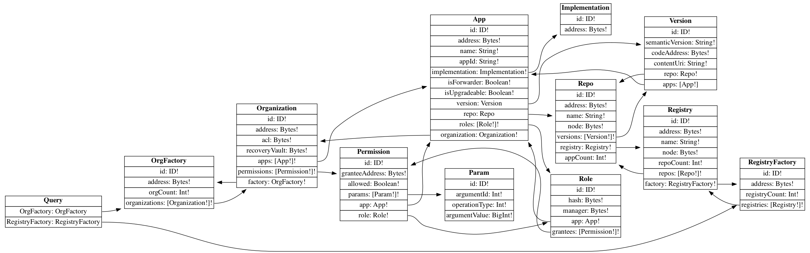

# Organizations

This is the main connector of the Aragon Connect library. It is responsible for parsing the organization’s data.

Currently a single flavor of this connector is available and comes built into the core library, connecting to a Subgraph (The Graph) data source,. We have plans to expand to other flavors, like an Ethereum connector that reduces the state directly from an Ethereum node’s JSON-RPC API, or a SQL connector that fetches data from a database, etc.

## Connector Interface

An organization connector must implement the [IOrganizationConnector](https://github.com/aragon/connect/blob/master/packages/connect-core/src/connections/IOrganizationConnector.ts) interface to be compatible with Aragon Connect.

## The Graph Connector

This connector was built using The Graph and uses GraphQL as a query language for fetching data.

### GraphQLWrapper

The Graph connector exports the `GraphQLWrapper` object. The wrapper is useful when you want to create low level requests and talk to the Subgraph directly.

To create a wrapper instance you need to provide the Subgraph URL endpoint:

```javascript
const wrapper = new GraphQLWrapper(SUBGRAPH_URL)
```

Once you have a wrapper instance you can use the following API to create custom queries.

#### API

**GraphQLWrapper\#performQuery\(query, args\)**

Perform a GraphQL query.

| Name    | Type                   | Description                                       |
| ------- | ---------------------- | ------------------------------------------------- |
| `query` | `DocumentNode`         | GraphQL query parsed in the standard GraphQL AST. |
| `args`  | `any = {}`             | Arguments to pass to fields in the query.         |
| returns | `Promise<QueryResult>` | Query result data.                                |

**GraphQLWrapper\#performQueryWithParser\(query, args, parser\)**

Perform a GraphQL query and parse the result.

| Name     | Type                 | Description                                       |
| -------- | -------------------- | ------------------------------------------------- |
| `query`  | `DocumentNode`       | GraphQL query parsed in the standard GraphQL AST. |
| `args`   | `any = {}`           | Arguments to pass to fields in the query.         |
| `parser` | `(data: any) => any` | Parser function.                                  |
| returns  | `Promise<any>`       | Query result data parsed.                         |

**GraphQLWrapper\#subscribeToQuery\(query, args, callback\)**

Create a GraphQL subscription.

| Name       | Type                                          | Description                                       |
| ---------- | --------------------------------------------- | ------------------------------------------------- |
| `query`    | `DocumentNode`                                | GraphQL query parsed in the standard GraphQL AST. |
| `args`     | `any = {}`                                    | Arguments to pass to fields in the query.         |
| `callback` | `(error: Error, result: QueryResult) => void` | Callback function call on every data update.      |
| returns    | `{ unsubscribe: () => void }`                 | Subscription handler.                             |

**GraphQLWrapper\#subscribeToQueryWithParser\(query, args, callback, parser\)**

Create a GraphQL subscription and parse the emitted results.

| Name       | Type                                  | Description                                       |
| ---------- | ------------------------------------- | ------------------------------------------------- |
| `query`    | `DocumentNode`                        | GraphQL query parsed in the standard GraphQL AST. |
| `args`     | `any = {}`                            | Arguments to pass to fields in the query.         |
| `callback` | `(error: Error, result: any) => void` | Callback function call on every data update.      |
| `parser`   | `(data: any) => any`                  | Parser function.                                  |
| returns    | `{ unsubscribe: () => void }`         | Subscription handler.                             |

### Subgraph Schema

The Subgraph schema defines all of the available entities and attributes. It may be useful to gain a fuller, clearer picture of the information you can request.


