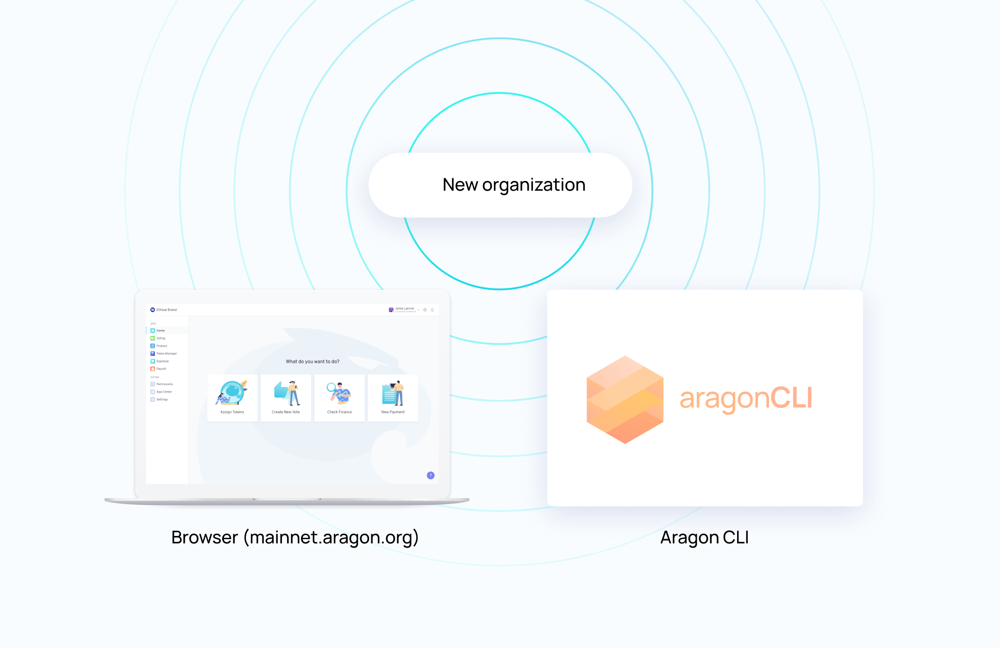
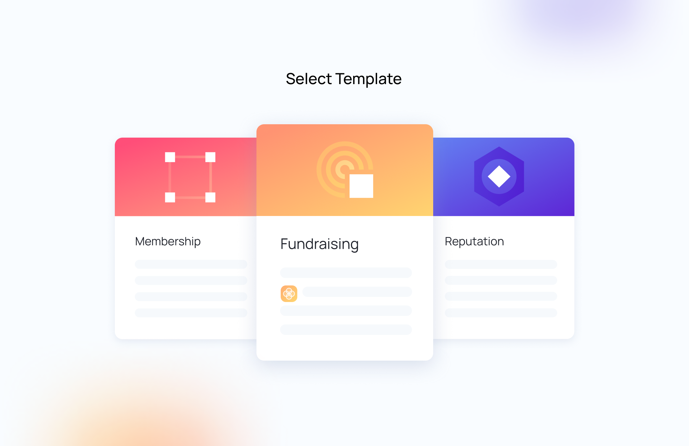
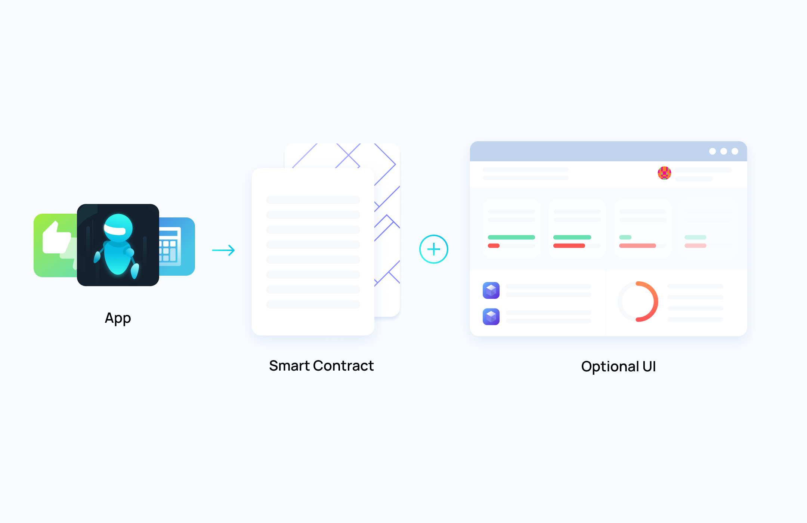
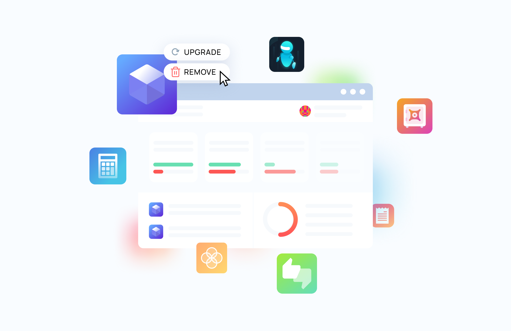
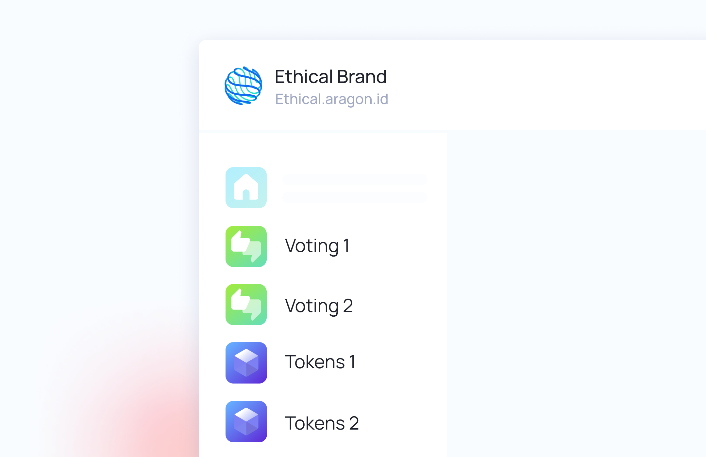
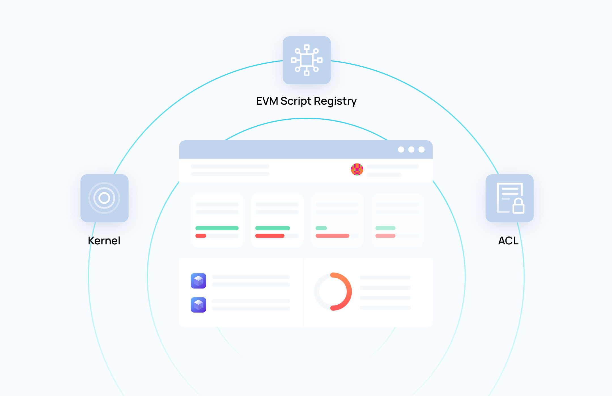
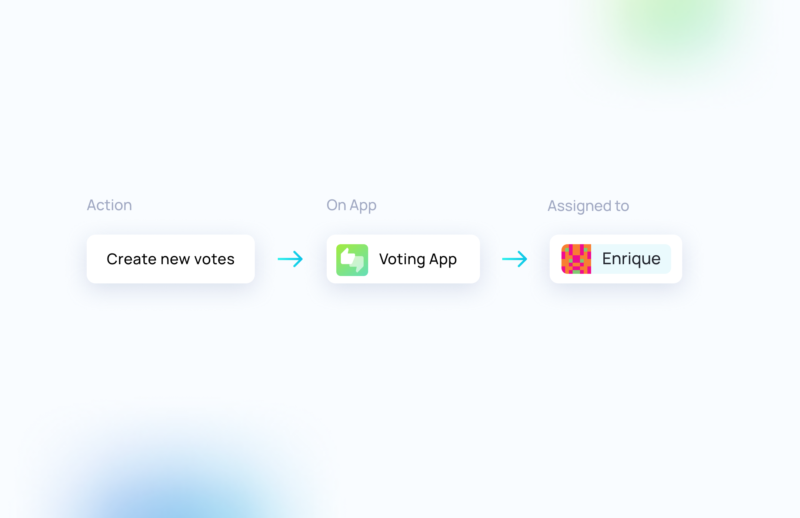

# Aragon Basics

This guide will explain some Aragon concepts that are relevant in the context of building with Aragon Connect.

## What is Aragon?

Aragon provides an open-source suite of applications and services that enable new forms of global communities \(or [DAOs](https://aragon.org/dao)\). Communities can organize around capital assets, currencies, or tokens, which may increase in value as more people hold and use that asset to participate in the community. These tools enable people to turn a community, cause, or even just a meme into its own economy. This technology unlocks a long-tail of DAO communities that could not have existed otherwise.

Aragon not only provides basic financial tools like tokenization, but can create reproducible and broadly applicable templates for defining the boundaries of a community and flowing value to contributors over the internet, without traditional intermediaries like banks.

This brings us to the central piece of the Aragon ecosystem: the **organization**.

## Organizations

An Aragon organization contains the tools needed for a community to organize its decentralized life. It is composed of a kernel, a series of apps, and a set of permissions that define the protocol of the organization: what can be done in what way.

The kernel of an organization, and each of its apps, are represented by smart contracts deployed on the Ethereum chain. Interacting with them can be done through the use of tools like [the Aragon client](https://mainnet.aragon.org/) for the browser, [aragonCLI](https://hack.aragon.org/docs/cli-intro.html) for the command line, or programmatically through [Aragon Connect](https://aragon.org/connect).

Most organizations are created from templates. Each template tries to address a specific need by providing a set of apps and permissions that come bundled at the start of each newly created organization. Usually, only one or two transactions are required to deploy a full-fleshed organization through a template.

Once deployed, organizations can be used and administered in an extremely flexible way. We will discover how apps, permissions, and forwarding paths each play a role in providing a great deal of freedom to organization creators and users.

## Apps

An essential part of any Aragon organization are the apps it installs. Every app adds a certain set of features to the organization, and may forward actions to other apps based on rules defined through permissions. An app consists of two components: **a smart contract**, and optionally, **a web app** that allows users to interact with it through a graphical interface.

Apps can be **installed, removed, or upgraded**, in a way that could be compared to how apps are managed on a computer or smartphone operating system. Who and how these tasks can be executed is entirely up to the permissions set on the organization.

But there is one point where Aragon apps clearly differ from traditional OS apps. In Aragon organizations, a given app can be installed multiple times. This is why we sometimes refer to them as **app instances**. This is a useful feature because a given app instance contains its own specific configuration and set of permissions that are not shared with other instances.

Every organization also contains a set of three **system apps**, which are generally not removed. These are also smart contracts, and provide core features to organizations:

- The organization kernel and its list of installed apps \(Kernel\).
- The permissions module of the organization \(ACL\).
- The ability to forward actions to other apps \(EVM Script Registry\).

## Permissions

Permissions are managed by the ACL system app. It essentially specifies who can execute an action in an Aragon app, and who can grant or revoke a permission.

An important aspect of permissions is that they are not limited to normal accounts: you can assign a permission to another app as well. For example, allowing the Tokens app to create votes on the Voting app would let any holder of this token to create votes. It could also be done the other way: assigning a token on the Tokens app could require a vote to pass on the Voting app. As you can see, combining permissions in this way offers a vast amount of possibilities.

## Forwarding paths

As we just saw with the permissions examples above, a given action may get redirected from one app to another, until the desired action \(on the "target" app\) can finally be executed. This series of actions jumping from one app to another is what we call the **forwarding path**. The process of computing all possible forwarding paths for a given action is called **transaction pathing**.

Most of our tools, including Aragon Connect, provide a way to compute the different paths that can be used to execute an action.

## Human readable transactions

An important goal for Aragon is to make user interactions simple and understandable. One recurrent problem in the Ethereum space is the way transactions are presented to users, often in a raw, machine format. The Solidity answer to this problem is the [NatSpec format](https://solidity.readthedocs.io/en/develop/natspec-format.html), which allows contract creators to attach function documentation that can be displayed to users. We created [Radspec](https://github.com/aragon/radspec) as a safer variant of NatSpec and integrated it into our tools and libraries.

## What Now?

Now that you are more familiar with the way Aragon organizations work, you might want to start immediately by reading [Getting Started for Aragon Connect](getting-started.md).

You might also want to know more about Aragon as a platform. In that case, we recommend you to have a look at our general documentation website: [hack.aragon.org](https://hack.aragon.org/).
