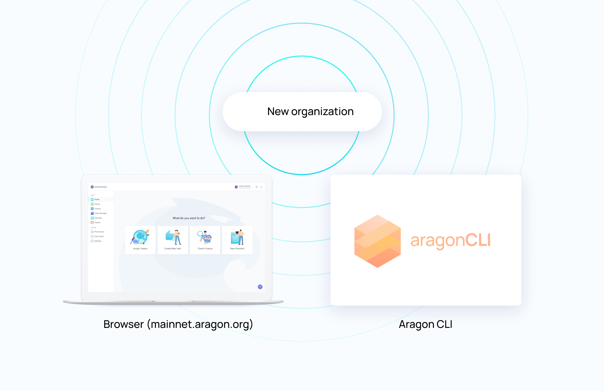
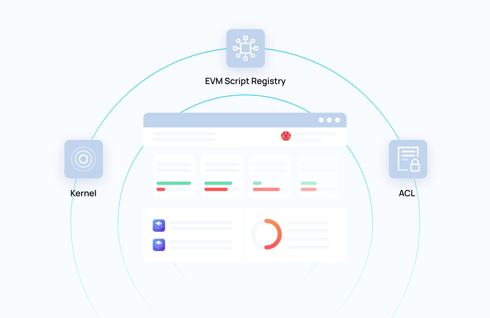
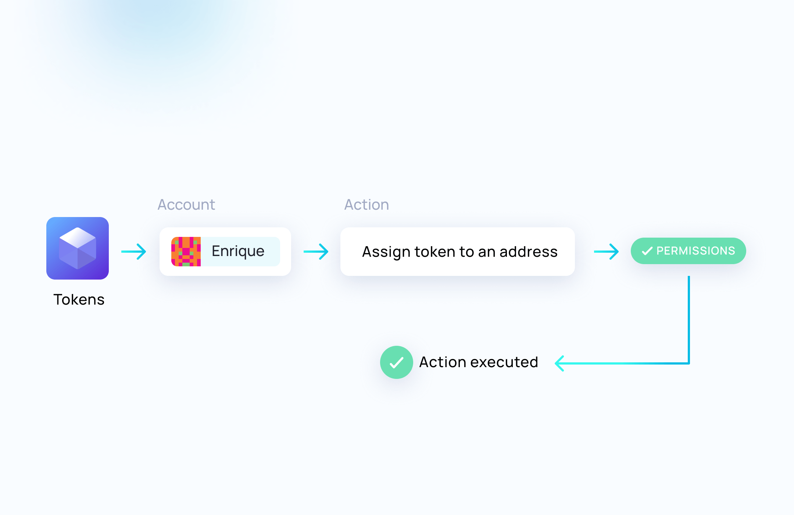
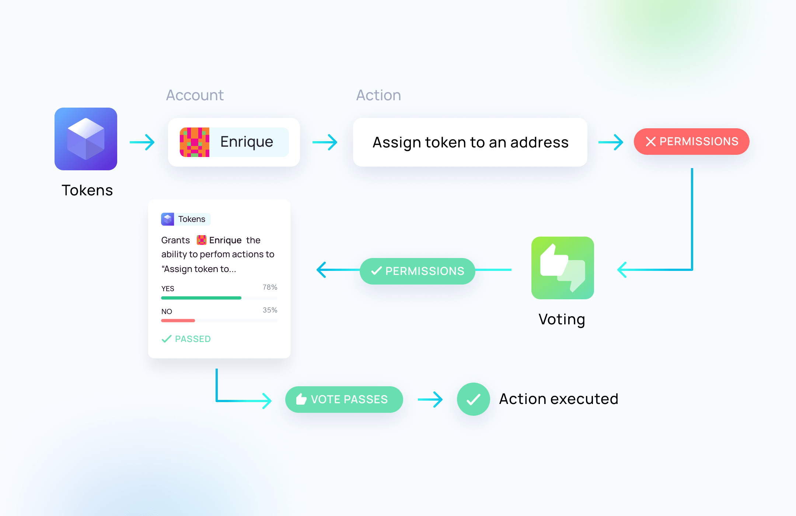
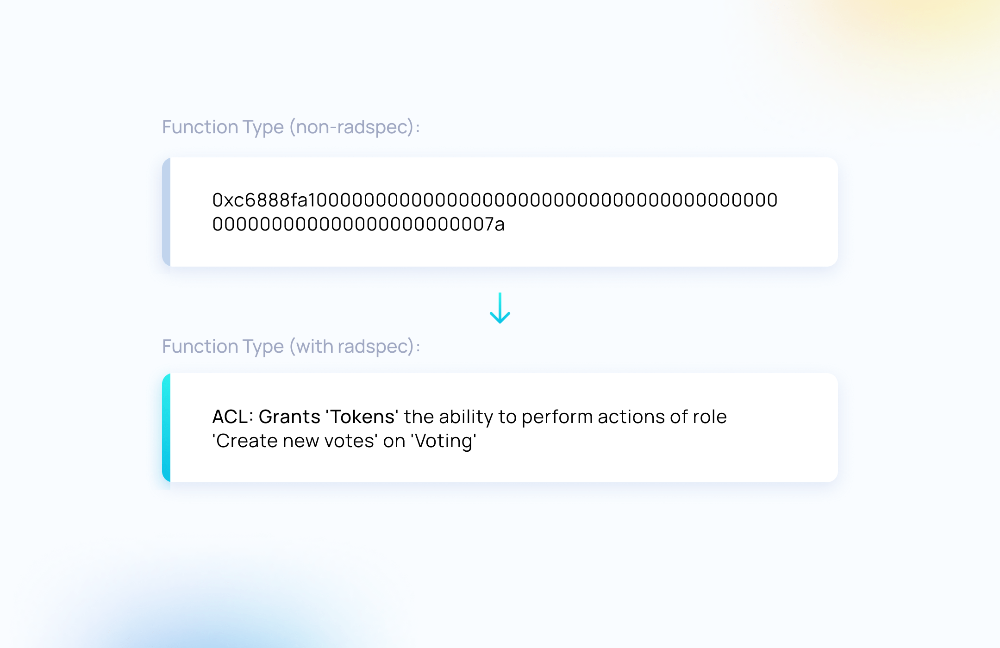

# Aragon Basics

This guide will explain some Aragon concepts that are relevant in the context of building with Aragon Connect.

## What is Aragon?

Aragon provides an open-source suite of applications and services that enable new forms of global communities \(or [DAOs](https://aragon.org/dao).\) Communities can organize around capital assets, currency, or tokens, which will increase in value as more people hold and use that asset to participate in the community. These tools enable people to turn a community, cause, or even just a meme into its own economy. We can unlock a long-tail of DAO communities that could not have existed otherwise.

Aragon not only provides basic financial tools like tokenization, but can create reproducible and broadly applicable templates for defining the boundaries of a community and flowing value to contributors over the internet, without traditional intermediaries like banks.

This brings us to the central piece of the Aragon ecosystem: the **organization**.

## Organizations

An Aragon organization contains the tools needed for a community to organize its decentralized life. It is composed of a kernel, a series of apps, and a set of permissions that define what can be done in in what way.

 _The decentralized nature of organizations allows to access them in various ways._

The kernel of an organization, and each of its apps, are represented by smart contracts deployed on the Ethereum chain. Interacting with them can be done done through the use of tools like [the Aragon client](https://mainnet.aragon.org/) for the browser, [aragonCLI](https://hack.aragon.org/docs/cli-intro.html) for the command line, or programmatically through [Aragon Connect](https://aragon.org/connect).

Organizations are created from templates. Each of them is trying to address a specific need by providing a set of apps and permissions that come bundled with the newly created organization.

 _There are a multiple templates to choose from, or you can create your own._

Once deployed, organizations can get used and administrated in an extremely flexible way. We will discover how apps, permissions and forwarding paths play a role into that.

## Apps

An essential part of any Aragon organization is the apps it contains. Every app adds a certain set of features to the organization, and can forward actions to other apps based on a set of rules defined as permissions. An app consists of two components: **a smart contract**, and optionally, **a web app** that allows to interact with it through a graphical interface.

 _Aragon apps are represented by a smart contract, and might also provide a frontend._

Apps can be **installed, removed or upgraded**, in a way that could be compared to how apps are managed on a computer or smartphone operating system. Who and how these tasks can be executed is entirely up to the the permissions set on the organization.

 _Apps can be installed, removed and upgraded._

But there is one point where Aragon apps clearly differ from traditional OS apps. In Aragon organizations, a given app can be installed multiple times. This is why we sometimes refer to them as **app instances**. This is a useful feature because a given app instances can contain a configuration and a set of permissions that are specific to it.

 _Multiple app instances can be installed in an organization._

Every organization also contain a set of three **system apps**, which are generally not removed. These are also smart contracts, and provide core features to organizations:

* The organization itself and its list of installed apps \(Kernel\).
* The permissions defined on the apps of the organization \(ACL\).
* The ability to forward actions to other apps \(EVM Script Registry\).

 _System apps provide the core features of organizations._

## Permissions

Permissions are managed by the ACL system app. It essentially contains who can execute an action in an Aragon app, and who can grant or revoke a given permission.

 _The three components of a permission: the app, its action, and what address can execute it._

An important aspect of permissions is that they are not limited to normal accounts: you can assign a permission to another app as well. For example, allowing the Tokens app to create votes on the Voting app would let any holder of this token to create votes. It could also be done the other way: assigning a token on the Tokens app could require a vote to pass on the Voting app. As you can see, combining permissions in this way offers a vast amount of possibilities.

## Forwarding paths

As we just saw with the permissions, a given action might get redirected from an app to app before being executed, until the desired action can get executed on the target app. This series of actions jumping from an app to another is what we call the **forwarding path**. The computation of all the possible forwarding paths for a given action is called **transaction pathing**.

 _Example: the permission is directly granted to the account of Enrique._

 _Example: the permission is granted to the Voting app which allows an indirect execution._

Most of our tools, including Aragon Connect, provide a way to compute the different paths that can get used to execute an action.

## Human readable transactions

An important goal for Aragon is to make things simple and understandable. One recurrent problem in the Ethereum world is the way transactions are being presented to users, often in a raw, machine format. The Ethereum answer to this problem is the [NatSpec format](https://solidity.readthedocs.io/en/develop/natspec-format.html), allowing to document functions in a dynamic way in order to be displayed to users. We created [Radspec](https://github.com/aragon/radspec) to interpret the NatSpec format in a safe way, and integrated it into our tools and libraries.

 _Radspec makes it possible to read transaction data in plain english._

## What Now?

Now that you are more familiar with the way Aragon organizations work, you might want to start immediately by reading [Getting Started for Aragon Connect](https://connect.aragon.org/).

You might also want to know more about Aragon as a platform. In that case, we recommend you to have a look at our general documentation website: [hack.aragon.org](https://hack.aragon.org/).

